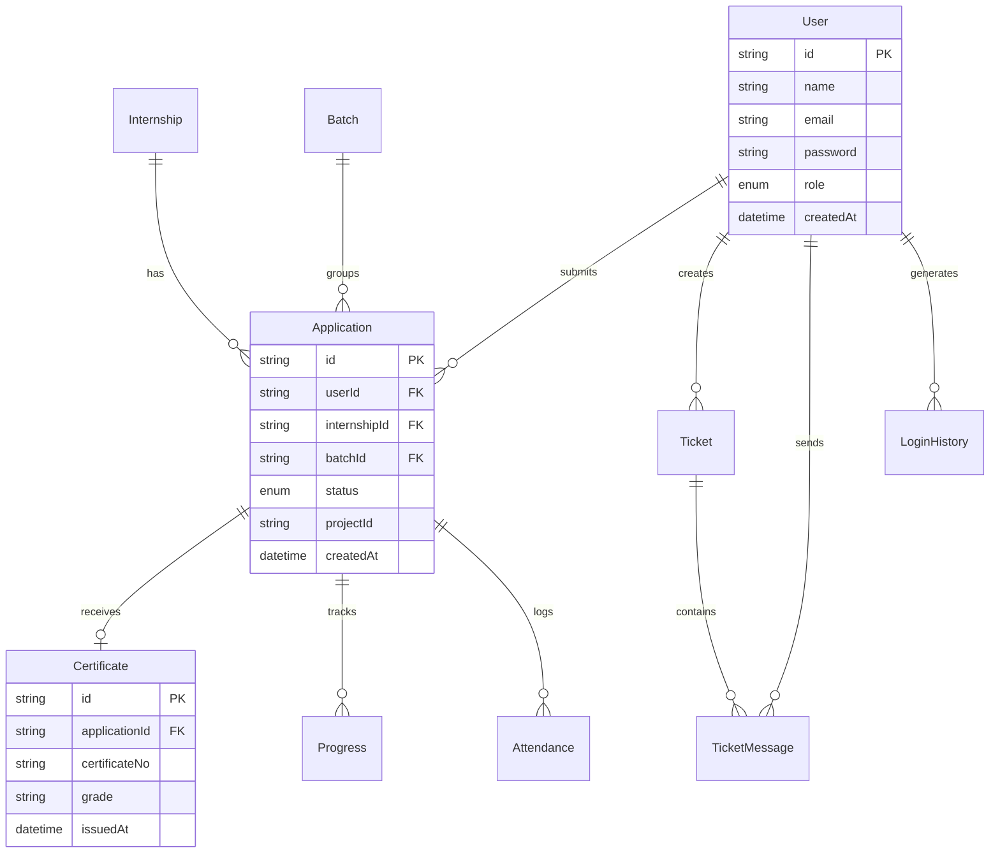

# Database Documentation

The database is built on PostgreSQL and managed via Prisma ORM. It enforces strict relational integrity, indexed queries, and cascading deletes where applicable.

## Entity Relationship Diagram



## Models & Indexes

- **User**: Represents all users (Admins, Students). Lookups are optimized by a `@@unique` index on `email`.
- **Application**: The core entity linking a student to an internship. Indexed on `[userId]`, `[internshipId]`, and `[projectId]`.
- **LoginHistory**: Tracks authentication for auditing. Indexed on `[userId]`.
- **Attendance**: Logs daily presence. Enforced via a `@@unique` constraint on `[applicationId, date]` to prevent duplicate check-ins.
- **Progress**: Weekly reports submitted by students. Enforced via `@@unique` on `[applicationId, weekNumber]`.

## Migration & Management

### Creating Migrations
Always use Prisma Migrate to evolve the schema securely.
```bash
npx prisma migrate dev --name <migration_name>
```

### Applying in Production
```bash
npx prisma migrate deploy
```

## Backup Strategy

- **Automated Daily Backups**: Managed by AWS RDS/Neon via point-in-time recovery.
- **Weekly Snapshots**: Full logical dumps stored securely in an encrypted S3 bucket.
- **Retention Policy**: Retain daily backups for 30 days, weekly snapshots for 6 months.
